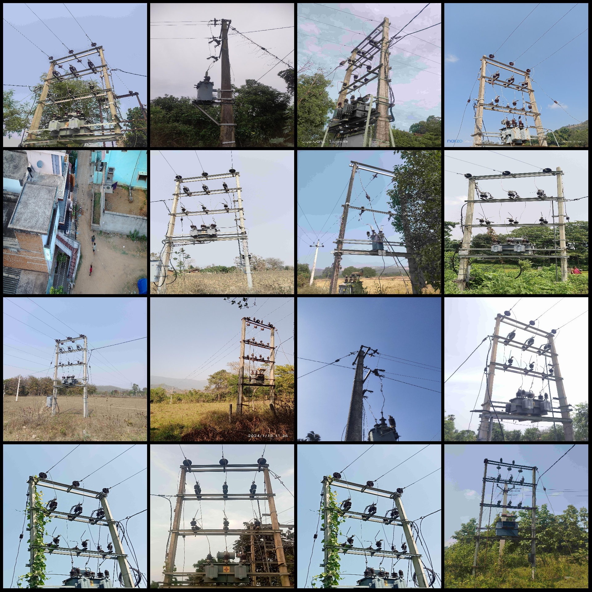
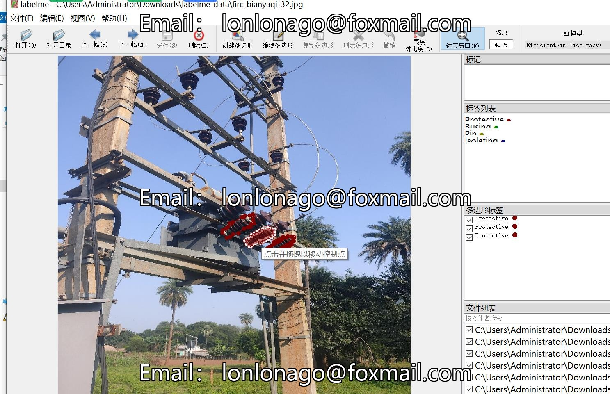

# Power Scenery: Segmentation of Transformer Pole Tower Parts in Labelme Format with 1220 Images and 5 Categories

Dataset format: Labelme format (without mask files, only including jpg images and corresponding json files)  
Number of images (number of jpg files): 1220  
Number of annotations (json file count): 1220  
Number of annotation categories: 5  
Annotation category names: ["Protective", "Isolating", "Busing", "Pin", "Other"]  
Number of boxes for each category:  
- Protective (protection class) count = 2619  
- Isolating (isolating class) count = 45  
- Busing (busing class) count = 71  
- Pin (pin class) count = 191  
- Other (other class) count = 120  
Total box count: 3046  
Tool used for annotation: labelme=5.5.0  
Image resolution: 2048x2048  
Annotation rules: Polygon drawing is used for categories  
Important note: The dataset can be opened and edited in labelme, but the json dataset needs to be converted into a mask or Yolo format or COCO format for semantic segmentation or instance 
segmentation.  
Special declaration: This dataset does not guarantee the accuracy of the trained model or the weight files.  
Image preview:  
Annotation example:  
Randomly selected 16 images for annotation:  
Annotation drawing result:  
Labelme editing image example:

Image

Here is a pay link on Stripe ( https://buy.stripe.com/3cs8yP7sY87d0vu9AB ). Please contact me lonlonago@foxmail.com after funding $89, and I will send you a complete data files , thank you!

